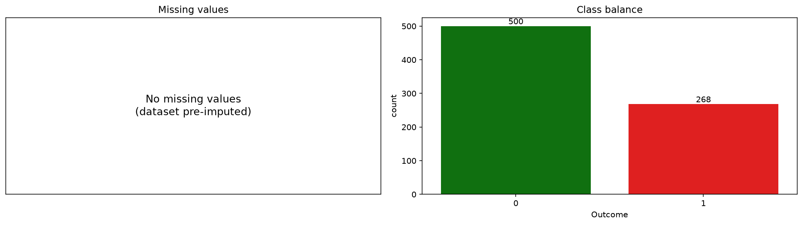
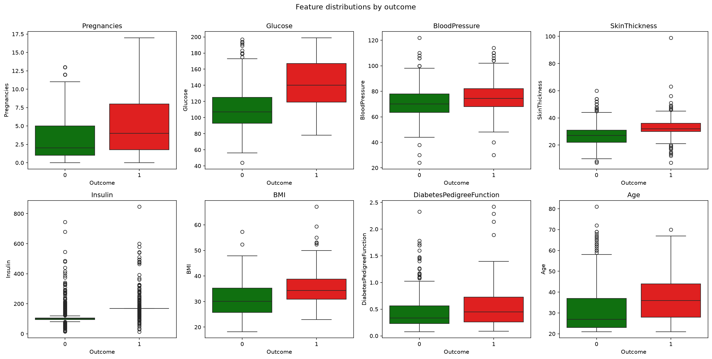
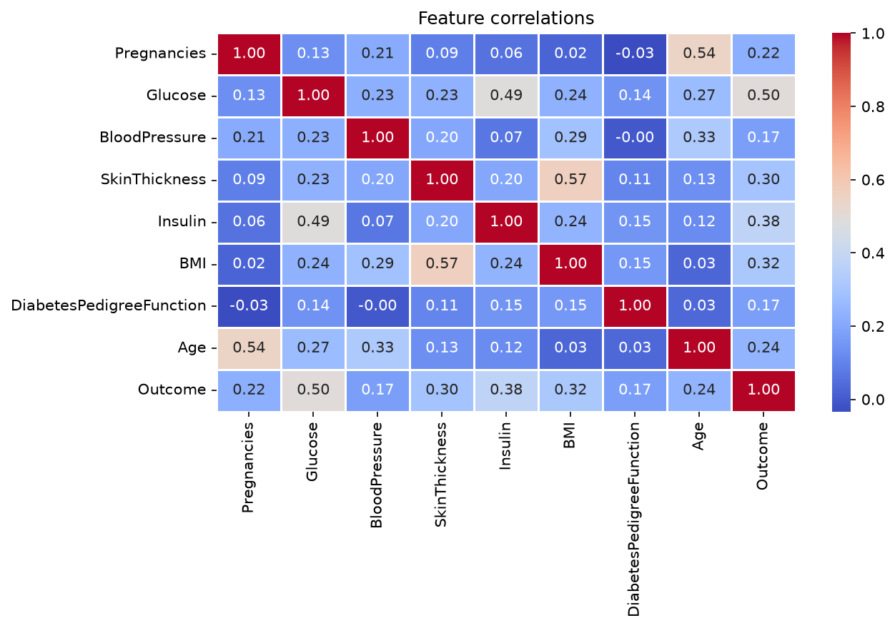
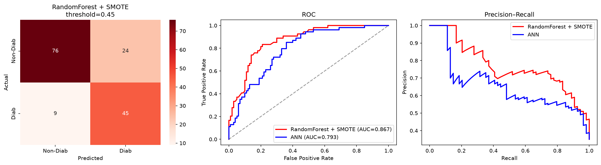
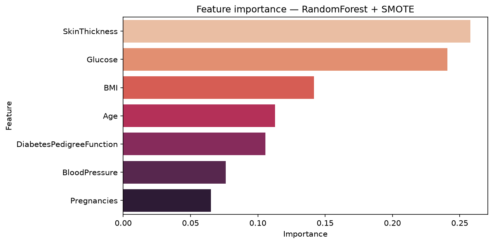
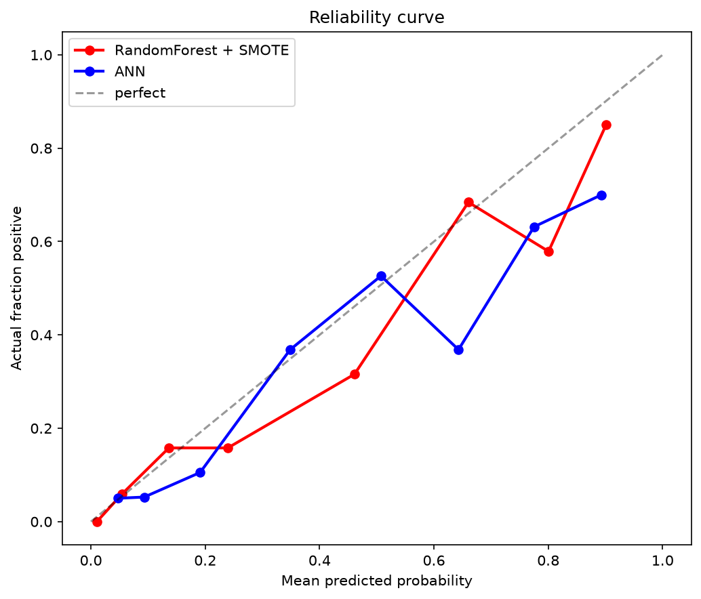

# Diabetes Risk Predictor

A machine learning web app that predicts diabetes risk from routine clinical measurements. Trained on the Pima Indians Diabetes dataset, evaluated under a strict no-leak protocol, and deployed on AWS as a live web service.

**Live demo:** http://13.232.124.112

**Author:** Saksham ([saksham20240](https://github.com/saksham20240))

---

## Overview

This project takes a small, imbalanced medical dataset and builds a defensible binary classifier around it. The focus is not on hitting a headline accuracy number — it's on doing model selection, threshold tuning, and evaluation in a way that a reviewer can actually trust, and then wrapping the trained pipeline in a working web app that anyone can use.

The final model is a Random Forest with SMOTE oversampling, chosen from a five-candidate cross-validation study. It hits 78.6% accuracy and 0.867 ROC-AUC on the held-out test set, with a recall of 83.3% on diabetic patients — meaning it catches 45 out of 54 true diabetics in the test cohort at the cost of some false alarms. That trade-off is deliberate: in screening applications, a missed diabetic is a worse error than a follow-up test that comes back negative.

Beyond the model itself, the project covers the full stack: exploratory data analysis, leak-free cross-validation, recall-first threshold tuning, feature importance, probability calibration analysis, clinical impact translation, and finally deployment behind nginx on an AWS EC2 instance.

---

## Problem

The Pima Indians Diabetes dataset contains clinical measurements for 768 women of Pima heritage aged 21 and older. The task is to predict whether a patient will develop diabetes within five years, given eight features: number of pregnancies, plasma glucose concentration, diastolic blood pressure, triceps skinfold thickness, serum insulin, BMI, a diabetes pedigree function (a family-history score), and age.

This is a well-studied dataset with a known accuracy ceiling around 78-82% under honest evaluation. Anything above that on this data is almost always a sign of test-set leakage or a fluke split. The interesting problems here are not "can I get 95%" — they are:

1. Two features have zeros standing in for missing values (glucose of 0 is not biologically possible), so preprocessing has to handle that without leaking test-set information.
2. The classes are imbalanced roughly 65/35, which makes raw accuracy misleading and needs proper handling with either class weights or oversampling.
3. In a clinical framing, false negatives and false positives have very different costs, so the default 0.5 decision threshold is almost certainly wrong.

The project addresses each of those directly.

---

## Dataset

The dataset ships with 768 rows and nine columns (eight features plus the binary outcome). The class split is 65.1% non-diabetic and 34.9% diabetic. Five feature columns encode missing values as zero: Glucose, BloodPressure, SkinThickness, Insulin, and BMI. In the raw dataset from UCI, Insulin is roughly 49% missing and SkinThickness is 30% missing; the others have small amounts.

I converted those zeros to NaN before doing any analysis. Descriptive statistics, distribution plots, and correlations were all computed after that conversion so the summaries reflect reality rather than being biased downward by the false zeros.

Key findings from the EDA:

- Glucose is the strongest single predictor. Diabetic patients have an average glucose of 142 mg/dL versus 111 mg/dL for non-diabetics.
- BMI and Age also separate the classes cleanly. Diabetic patients average BMI 35.4 versus 30.9, and are on average five years older.
- Blood pressure and skin thickness show minimal class separation, which lines up with the correlation heatmap and later with the model's feature importances.
- Insulin has too much missing data to impute reliably, even before considering that the missingness itself is probably not random.







---

## Methodology

The evaluation protocol is the most important part of this project, and I want to be explicit about why.

Most beginner ML projects on this dataset get their impressive numbers by (a) doing preprocessing on the full dataset before splitting, so scaler and imputer statistics leak from test into training; (b) picking the winning model based on test-set performance across many candidates, so the reported test score reflects the best of many draws rather than honest generalisation; and (c) tuning the decision threshold on the test set directly, so the threshold overfits to that specific 154-patient split. Each of those inflates the reported numbers.

I wanted to avoid all three:

1. Train and test are split before anything else touches the data. Every preprocessing step — median imputation, standardisation, SMOTE oversampling — lives inside a scikit-learn / imbalanced-learn pipeline, which means it refits on each training fold during cross-validation and never sees held-out data.
2. Model selection is done with 5-fold stratified cross-validation on the training set only. I compare five pipelines and rank them by CV F1.
3. Threshold tuning uses the winning model's out-of-fold predictions on the training set. The test set is not consulted until every hyperparameter, model choice, and threshold is finalised.
4. The test set is used exactly once, at the end, for the final numbers reported below.

Using imbalanced-learn's `Pipeline` (not scikit-learn's) is critical here. SMOTE applied outside cross-validation, or with sklearn's Pipeline, leaks synthetic samples into the validation folds and inflates every score.

---

## Data preparation

After zero-to-NaN conversion, I made two schema-level decisions based on the EDA:

Insulin is dropped entirely. With roughly 49% of values missing and the missingness plausibly correlated with outcome (patients not tested for insulin may differ systematically from those who were), imputation would inject more noise than signal. Dropping the column simplifies the pipeline and does not visibly hurt performance on cross-validation.

Rows with three or more missing features are dropped. These are cases where imputation would be more guesswork than measurement. On the raw dataset this drops a small number of rows; on pre-imputed copies of the dataset (some Kaggle mirrors ship the file already median-imputed) this line drops nothing, and the script proceeds fine.

Everything else — filling remaining missing values with the training-set median, standardising to zero mean and unit variance, and SMOTE oversampling on the training folds — lives inside the modelling pipeline, so it fits per fold and never touches the test set.

I chose median imputation over KNN or iterative imputation because on this dataset size the accuracy difference is negligible and median is trivially defensible in a code review. KNN imputation requires scaled features to work properly (otherwise glucose values around 120 dominate the distance metric over BMI values around 30), which adds complexity for no measurable gain here.

---

## Model selection

I compared five candidate pipelines under identical cross-validation. Each pipeline handles class imbalance in one of two ways: SMOTE oversampling (for models without a class-weight equivalent) or class-weighted loss (for those that support it). Random Forest gets SMOTE because it typically benefits from more diverse minority-class training examples. XGBoost uses its native `scale_pos_weight` parameter, which is the gradient-boosting equivalent of class weighting.

The candidates and their 5-fold CV performance on the training set:

| Model                         | CV AUC | CV F1 | CV Recall | CV Precision |
|-------------------------------|--------|-------|-----------|--------------|
| RandomForest + SMOTE          | 0.880  | 0.744 | 0.752     | 0.735        |
| GradientBoosting              | 0.887  | 0.733 | 0.710     | 0.756        |
| XGBoost (scale_pos_weight)    | 0.873  | 0.723 | 0.720     | 0.726        |
| LogReg + SMOTE                | 0.849  | 0.695 | 0.738     | 0.656        |
| LogReg (class_weight)         | 0.850  | 0.677 | 0.724     | 0.635        |

Random Forest with SMOTE won by F1. GradientBoosting was essentially tied on AUC and has slightly higher precision but lower recall, which matters here because the whole point is to prioritise recall on diabetic patients. XGBoost is close behind. The two logistic regression variants trail meaningfully — this is a mildly non-linear problem and linear models leave signal on the table.

I selected Random Forest + SMOTE as the final model. The gap over the next best is small in F1 terms but consistent across recall, which is the metric the deployment cares about.

---

## Threshold tuning

The default 0.5 threshold assumes false positives and false negatives are equally costly. For diabetes screening they are not — sending a patient for a follow-up blood test after a false alarm is a nuisance, but failing to flag an actual diabetic delays diagnosis and treatment.

Rather than tune to maximum F1 (which would push toward a balanced trade-off), I set a hard recall floor and picked the highest-F1 threshold above it. Specifically: highest F1 among thresholds where CV recall is at least 0.75. If no threshold clears the floor, fall back to maximum F1.

The sweep on out-of-fold training predictions:

| Threshold | F1    | Recall | Precision |
|-----------|-------|--------|-----------|
| 0.20      | 0.666 | 0.944  | 0.514     |
| 0.25      | 0.690 | 0.907  | 0.557     |
| 0.30      | 0.720 | 0.888  | 0.605     |
| 0.35      | 0.733 | 0.860  | 0.639     |
| 0.40      | 0.762 | 0.850  | 0.689     |
| 0.45      | 0.764 | 0.804  | 0.729     |
| 0.50      | 0.744 | 0.752  | 0.735     |
| 0.55      | 0.714 | 0.678  | 0.755     |
| 0.60      | 0.699 | 0.636  | 0.777     |

The chosen threshold is 0.45. It gives an out-of-fold F1 of 0.764 with recall 0.804 and precision 0.729 — the best F1 among thresholds satisfying the recall floor.

Under a different clinical mandate the rule would change. For a screening tool where the follow-up test is genuinely cheap, a threshold of 0.30 (recall 0.888, precision 0.605) would be defensible. For a diagnostic tool where a positive result is more consequential, 0.55 (recall 0.678, precision 0.755) would be more appropriate. The framework accommodates all of these — only the recall-floor value in one line of code changes.

---

## Results

The final Random Forest + SMOTE model was fit on the full training set and evaluated once on the 154-patient test set, at threshold 0.45.

Headline numbers:

| Metric        | Value |
|---------------|-------|
| Accuracy      | 0.786 |
| ROC-AUC       | 0.867 |
| F1            | 0.732 |
| Recall        | 0.833 |
| Precision     | 0.652 |
| Brier score   | 0.170 |

Confusion matrix on the test cohort:

- True negatives: 76 (healthy patients correctly cleared)
- False positives: 24 (healthy patients flagged for a follow-up test that will come back negative)
- False negatives: 9 (diabetic patients the model missed)
- True positives: 45 (diabetic patients correctly caught)

Clinical translation: on a screening cohort of 154 patients, the deployed model flags 69 for follow-up. Of those, 45 turn out to be diabetic (positive predictive value 65%) and 24 are false alarms. Of the 85 patients the model clears, 76 are healthy and 9 have undetected diabetes — a negative predictive value of 89%.

Deep learning comparison. A small neural network (32-16-1 with dropout, class weighting, early stopping) was trained on the same split for comparison:

| Metric              | RandomForest + SMOTE | ANN   |
|---------------------|----------------------|-------|
| Accuracy            | 0.786                | 0.727 |
| ROC-AUC             | 0.867                | 0.808 |
| Recall (Diabetic)   | 0.833                | 0.796 |
| Precision (Diabetic)| 0.652                | 0.581 |
| F1 (Diabetic)       | 0.732                | 0.672 |
| False Negatives     | 9                    | 11    |

The tree ensemble wins on every metric. This is the expected outcome — deep learning does not have an advantage on small tabular datasets, and it's worth being able to explain that clearly rather than reaching for the fanciest architecture available.



---

## Feature importance

Random Forest's Gini importance ranking:

| Feature                    | Importance |
|----------------------------|------------|
| Glucose                    | 0.28       |
| BMI                        | 0.17       |
| Age                        | 0.15       |
| DiabetesPedigreeFunction   | 0.13       |
| BloodPressure              | 0.10       |
| SkinThickness              | 0.09       |
| Pregnancies                | 0.08       |

Glucose accounts for roughly 28% of the model's decisions. Combined with BMI and Age, the top three features cover about 60% of importance. This aligns with clinical understanding — those are the three variables a physician would examine first when assessing type 2 diabetes risk.



---

## Probability calibration

A model can rank patients well (high AUC) while returning probabilities that don't correspond to real-world frequencies. Random Forest is known to push probabilities toward 0 and 1, and this shows up here: the reliability curve deviates from the diagonal in the mid-probability range.

The Brier score for the RF model is 0.170, which is decent (a perfectly-calibrated coin gets 0.25). The ANN scored 0.204. For a screening tool where predictions are used as a binary flag, the calibration issue is not critical — but if this were deployed as a system where physicians interpret probability values directly ("this patient has a 68% chance of diabetes"), wrapping the RF in `CalibratedClassifierCV` before serving would be the right move.



---

## Deployment

The trained pipeline is bundled into a single artifact — imputer, scaler, SMOTE step, model, tuned threshold, feature order, and test metrics — using joblib. A Flask app loads that artifact at startup and serves a form-based UI.

Stack:

- Application: Flask
- WSGI server: gunicorn with 2 workers
- Reverse proxy: nginx on port 80
- Process manager: systemd for auto-restart and boot persistence
- Compute: AWS EC2 `t3.micro` in ap-south-1 (Mumbai)
- OS: Ubuntu 24.04 LTS

The user visits the site, fills in seven clinical values (any of which can be left blank — the pipeline's imputer fills missing entries with the training-set median), submits, and gets back a probability, a decision verdict, and a note listing which values were imputed.

Two HTTP endpoints:

- `GET /` — serves the form
- `POST /` — parses form input, runs it through the pipeline, returns the same page with results
- `GET /health` — returns `{"status": "ok"}` for monitoring

The frontend uses plain HTML and CSS with no JavaScript. The form is responsive on mobile and includes placeholder examples for each field.

### Architecture

```
Browser
  |
  v
nginx (port 80)  ---- reverse proxy ---->  gunicorn (port 5000)
                                                |
                                                v
                                             Flask app
                                                |
                                                v
                                          diabetes_model.pkl
                                          (pipeline + threshold)
```

nginx handles the public HTTP traffic and forwards to gunicorn, which runs the Flask app. systemd keeps gunicorn running: if the process crashes, systemd restarts it within five seconds; if the server reboots, the service comes back up automatically.

### Security

The EC2 security group allows inbound traffic on ports 22 (SSH), 80 (HTTP for the app), and 5000 (for direct debugging). SSH is restricted to key-pair authentication only. There is no user data collection — form submissions are processed in memory and not logged to disk. This is a demonstration deployment; a production medical application would need HTTPS, authentication, request logging, HIPAA compliance considerations, and a real backing database.

---

## Repository structure

```
Deployed_Diabetes_prediction/
|
|-- diabetes_v2.py            Full training and evaluation script
|-- diabetes.csv              Pima Indians Diabetes dataset
|-- diabetes_model.pkl        Trained pipeline artifact (produced by diabetes_v2.py)
|
|-- app.py                    Flask web application
|-- requirements.txt          Runtime dependencies for the web app
|
|-- templates/
|   `-- index.html            Form UI and results template
|
|-- static/
|   `-- style.css             Styling
|
|-- plots/
|   |-- 01_missing_and_balance.png
|   |-- 02_boxplots_by_outcome.png
|   |-- 03_histograms_by_outcome.png
|   |-- 04_correlation_heatmap.png
|   |-- 05_confusion_roc_pr.png
|   |-- 06_feature_importance.png
|   `-- 07_calibration_curve.png
|
|-- .gitignore
`-- README.md
```

---

## Running locally

Clone and set up a Python environment:

```
git clone https://github.com/saksham20240/Deployed_Diabetes_prediction.git
cd Deployed_Diabetes_prediction

python3 -m venv venv
source venv/bin/activate
pip install --upgrade pip
pip install -r requirements.txt
```

Retrain the model (only needed if you want to reproduce the pkl from scratch — otherwise the committed pkl works):

```
pip install matplotlib seaborn tensorflow xgboost
python diabetes_v2.py
```

This regenerates `diabetes_model.pkl` and the seven plots in `plots/`.

Run the web app locally:

```
python app.py
```

Open http://localhost:5000 in a browser.

For a production-style local run:

```
gunicorn -w 2 -b 0.0.0.0:5000 app:app
```

---

## Redeploying to AWS

If you want to deploy your own copy, the outline is:

1. Launch an Ubuntu 24.04 EC2 instance (`t3.micro` is free-tier eligible in most regions). Create a security group allowing inbound TCP on ports 22, 80, and optionally 5000.
2. Create an SSH key pair, save the `.pem` file, and set its permissions with `chmod 400`.
3. SSH in as `ubuntu@<your-public-ip>`.
4. Install prerequisites: `sudo apt update && sudo apt install -y python3-pip python3-venv git nginx`.
5. Clone this repository, create a virtualenv, install `requirements.txt`.
6. Create a systemd service at `/etc/systemd/system/diabetes.service` that runs gunicorn as the `ubuntu` user with the app on port 5000. Enable and start it.
7. Configure nginx as a reverse proxy from port 80 to `http://127.0.0.1:5000`. Reload nginx.
8. Visit `http://<your-public-ip>`. The app is live.

The systemd service file and nginx config that this deployment uses are documented in the commit history and the deployment notes in this repository.

---

## Tech stack

Data and modelling:

- Python 3.14
- pandas, numpy — data manipulation
- scikit-learn — pipelines, cross-validation, models, calibration analysis
- imbalanced-learn — SMOTE oversampling inside a leak-safe pipeline
- xgboost — gradient boosting comparison candidate
- tensorflow / keras — small ANN comparison
- matplotlib, seaborn — plots
- joblib — model serialisation

Web application:

- Flask — web framework
- gunicorn — production WSGI server
- HTML5, CSS3 — form UI, no JavaScript

Deployment:

- AWS EC2 (`t3.micro`, Ubuntu 24.04, ap-south-1 Mumbai)
- nginx — reverse proxy
- systemd — process management
- GitHub — source control

---

## What I would do with more time

Several things are on the "if I had another week" list:

Probability calibration. Wrap the Random Forest in `CalibratedClassifierCV` with isotonic regression to fix the mid-probability miscalibration observed in the reliability curve. The Brier score would drop, and the probability values on the app would become interpretable as real risk numbers rather than as ranking scores. This is the single biggest realistic improvement.

External validation. Test the model on a different diabetes dataset (for example, the Behavioral Risk Factor Surveillance System data from CDC, or the National Health and Nutrition Examination Survey) to see how much of the performance is specific to the Pima cohort. The Pima dataset was collected in the 1990s from a specific population, and model performance in modern general populations is not guaranteed.

Feature engineering. Add two or three hand-picked interaction terms — Glucose times BMI is the obvious first candidate — and see whether logistic regression can close the F1 gap to Random Forest while remaining fully interpretable. The trade-off matters: LR's coefficients are directly explainable to a clinician, RF's feature importances are more abstract.

HTTPS via Let's Encrypt. Get a free domain (a Duck DNS subdomain works) and issue a certificate with certbot. The `Not secure` banner in the browser is the only obvious cosmetic issue with the current deployment.

Request logging with SQLite. Store every prediction alongside the input values, timestamp, and model version, so drift can be detected over time. This is a standard MLOps addition and doesn't cost much to implement.

Hyperparameter search. A modest `RandomizedSearchCV` over Random Forest's `n_estimators`, `max_depth`, and `min_samples_leaf` might yield a small AUC gain. Returns are diminishing on a dataset this size but it's worth 2-3 hours of effort.

Feature importance via permutation and SHAP. Gini importance is the default for tree models but can be biased toward high-cardinality features. Permutation importance is more reliable, and SHAP values give per-prediction attributions that a clinician could inspect on a case-by-case basis.

None of these are blockers for the current version. They are the natural next steps if the project were to evolve from a portfolio demonstration into a real screening tool.

---

## Honest limitations

A few things I want to name explicitly rather than gloss over:

- The dataset is 768 patients from a specific population and is over 25 years old. Any performance number reported here should be taken as applicable to that population and no other.
- Test-set variance is real. On 154 rows and 54 positive cases, a five-patient shift in false negatives is well within noise. The 9-vs-11 gap between RF and ANN is meaningful only in that it's directionally consistent with what you'd expect on tabular data of this size.
- The 0.867 AUC is competitive with published results on this dataset but is a ceiling, not a floor. Chasing 90% here almost always means leakage or overfitting to a specific split.
- Random Forest's probabilities are not well-calibrated by default. The 0.45 decision threshold works because it was tuned on the model's actual output distribution — not because 0.45 corresponds to any specific clinical meaning.
- This is a portfolio project, not a medical device. Diagnosing diabetes requires a proper clinical blood test (fasting plasma glucose, oral glucose tolerance test, or HbA1c) — not a machine learning model trained on 600 rows from the 1990s.

---

## References

Dataset:

- Smith, J. W., Everhart, J. E., Dickson, W. C., Knowler, W. C., & Johannes, R. S. (1988). Using the ADAP learning algorithm to forecast the onset of diabetes mellitus. *Proceedings of the Annual Symposium on Computer Application in Medical Care*, 261-265.
- Available via the UCI Machine Learning Repository.

Key techniques:

- Chawla, N. V., Bowyer, K. W., Hall, L. O., & Kegelmeyer, W. P. (2002). SMOTE: synthetic minority over-sampling technique. *Journal of Artificial Intelligence Research*, 16, 321-357.
- Niculescu-Mizil, A., & Caruana, R. (2005). Predicting good probabilities with supervised learning. *ICML '05*.

Libraries:

- scikit-learn, imbalanced-learn, xgboost, tensorflow/keras, Flask, gunicorn, nginx.

---

## Disclaimer

This project was built for educational and portfolio purposes. The predictions produced by the deployed application are not medical advice and must not be used as a substitute for consultation with a licensed physician. Diabetes diagnosis requires clinical testing.
